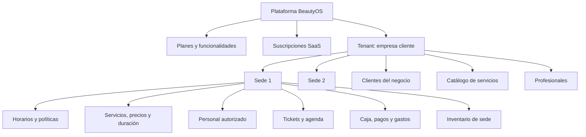
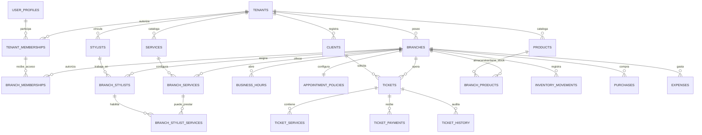

# Fase 1 — Modelo rector multi-tenant y multisede

**Estado:** diseño completado; pendiente de implementación técnica y pruebas  
**Fecha:** 19 de julio de 2026  
**Alcance:** estructura organizacional, sedes, catálogos, operación y aislamiento.

## 1. Decisión principal

BeautyOS tendrá tres fronteras diferentes:

1. **Plataforma BeautyOS:** administra tenants, planes, suscripciones y soporte auditado.
2. **Tenant:** representa la empresa cliente y conserva sus catálogos e historial general.
3. **Sede (`branch`):** representa el lugar físico u operativo donde se presta, agenda, cobra y mueve inventario.

Bella Mujer seguirá siendo el tenant ficticio existente y recibirá una primera sede llamada **Sede principal** durante la migración.

## 2. Jerarquía del dominio

## 3. Modelo conceptual de relaciones

## 4. Alcance de cada frontera

### Tenant

No se duplican por sede: `tenants`, `clients`, `services`, `stylists`, `products`, identidad global `user_profiles` y autorización `tenant_memberships`.

### Sede

Requieren `branch_id`: horarios, políticas de reserva, servicios/precios/duración habilitados, personal/capacidades, tickets, agenda, historiales, pagos, caja, gastos, compras, stock y movimientos. Fotos y reseñas heredan la sede del ticket.

## 5. Entidades rectoras nuevas

### `branches`

Campos mínimos: `id`, `tenant_id`, `name`, `slug`, `timezone`, `currency_code`, contacto, dirección, coordenadas, `booking_mode`, `active`, `created_at`, `updated_at`.

Reglas: único `(tenant_id, slug)`; zona predeterminada `America/Bogota`; moneda `COP`; una sede inactiva conserva historia pero no admite reservas nuevas.

### `tenant_memberships`

Relaciona persona y empresa: `tenant_id`, `user_id`, `role`, `active`, vigencia y auditoría. Roles iniciales: `tenant_owner`, `admin`, `assistant`, `stylist`. El cliente final no es miembro del equipo.

### `branch_memberships`

Relaciona membresía y sede. El owner tiene alcance total por regla; admin, assistant y stylist solo operan sedes asignadas. Tenant, sede y membresía deben coincidir por restricción de base de datos.

### `branch_services`

Configura `service_id`, sede, precio, duración, intervalo, visibilidad pública y estado. Único `(branch_id, service_id)`. El ticket conserva snapshots de precio/duración.

### `branch_stylists` y `branch_stylist_services`

Asignan profesionales a sedes y determinan qué servicios pueden prestar allí. Un profesional puede trabajar en varias sedes del mismo tenant. La disponibilidad exige coincidencia de sede, servicio, profesional, horario, vigencia y ausencia de choque.

### `branch_products`

Separa stock, mínimo, costo promedio y disponibilidad por sede. `products` queda como catálogo del tenant; el campo actual `current_stock` se migrará al registro de sede.

## 6. Contexto activo de aplicación

1. Usuario inicia sesión.
2. BeautyOS obtiene membresías activas.
3. Si existe una sola sede autorizada, la selecciona automáticamente.
4. Si existen varias, muestra selector de tenant/sede.
5. Flutter conserva el contexto durante la sesión.
6. Cada RPC operativa recibe `p_branch_id`.
7. La función valida nuevamente que `auth.uid()` puede operar esa sede.

Nunca se aceptará un `tenant_id` enviado por Flutter como prueba de autorización.

## 7. Aislamiento e integridad

Cada operación comprueba: sesión, membresía activa, sede perteneciente al tenant, permiso del rol y acceso a sede. Las tablas operativas mantendrán `tenant_id` y añadirán `branch_id` para RLS, reportes e índices rápidos. La consistencia se protegerá con claves foráneas compuestas o funciones transaccionales.

Funciones internas previstas en esquema no expuesto `private`:

- `private.is_active_tenant_member(p_tenant_id)`
- `private.has_tenant_role(p_tenant_id, p_roles)`
- `private.can_access_branch(p_branch_id, p_roles)`
- `private.is_tenant_operational(p_tenant_id)`
- `private.has_entitlement(p_tenant_id, p_feature_key)`

Las RPC `security definer` tendrán `search_path` fijo, comprobación de `auth.uid()`, ejecución revocada a `PUBLIC` y concesión explícita al rol necesario.

## 8. Rendimiento e integridad

- Índice en toda clave foránea.
- Índices compuestos como `(tenant_id, branch_id, scheduled_at)` y `(tenant_id, branch_id, status)`.
- Índices parciales para citas activas, pagos no anulados, membresías activas y servicios visibles.
- `timestamptz` para instantes; `date` y `time` para calendarios locales.
- Historiales, pagos y movimientos no se eliminan en cascada.
- Los estados se cambian por funciones de dominio, no por escritura libre.

## 9. Decisiones cerradas

- Tenant con una o más sedes.
- Profesional en varias sedes del mismo tenant.
- Clientes, profesionales, servicios y productos son catálogos del tenant.
- Precio, duración, capacidad, horario, caja y stock son de sede.
- Una cuenta podrá pertenecer a varios tenants.
- Bella Mujer se migra a Sede principal sin perder historial.
- Las alertas operativas continúan pausadas.

## 10. Puerta de salida

El diseño queda cerrado junto con:

- `ROLES_Y_PERMISOS.md`
- `SUSCRIPCION_Y_ENTITLEMENTS.md`
- `IMPACTO_Y_MIGRACION_MULTISEDE.md`
- `../04_pruebas/CRITERIOS_SALIDA_FASE_1.md`

La implementación comenzará por el Tramo 0 de inventario/respaldo y avanzará únicamente por las puertas definidas. La fase solo será considerada implementada después de las pruebas negativas entre dos sedes y dos tenants.
