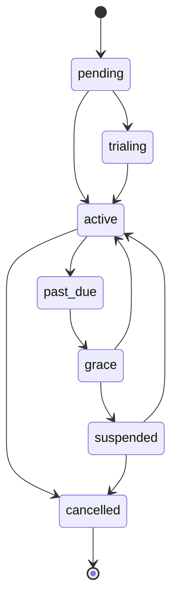

# Suscripción SaaS, planes y funcionalidades

**Estado:** diseño rector aprobado para implementación  
**Fecha:** 19 de julio de 2026  
**Alcance:** cobro recurrente de BeautyOS; no confundir con pagos de clientes al centro.

## 1. Separación de dineros

BeautyOS manejará dos dominios financieros independientes:

- **Facturación SaaS:** el tenant paga a BeautyOS su mensualidad.
- **Operación del centro:** el cliente paga servicios al tenant.

Nunca compartirán tablas de pagos, anulaciones, conciliación ni reportes. Una falla del proveedor SaaS no altera los pagos históricos del salón.

## 2. Planes iniciales

| Capacidad | Básico | Business | Profesional |
|---|:---:|:---:|:---:|
| Sedes, clientes, equipo, servicios y agenda | Sí | Sí | Sí |
| Reserva web/QR | Sí | Sí | Sí |
| WhatsApp asistido/enlace | Sí | Sí | Sí |
| Estados, choques y operación diaria | Sí | Sí | Sí |
| Pagos, caja y comisiones | Sí | Sí | Sí |
| Inventario, compras y gastos | — | Sí | Sí |
| Reportes financieros ampliados | — | Sí | Sí |
| Fotos de trabajos y reseñas | — | — | Sí |
| Publicación social asistida | — | — | Sí |

Los límites comerciales —sedes, usuarios, mensajes, almacenamiento u otros— no se codifican como constantes en Flutter: serán datos configurables del plan.

## 3. Modelo de datos

### `plans`

Identidad comercial, nombre, periodicidad, precio de lista, moneda, estado y versión.

### `features`

Catálogo estable de capacidades, por ejemplo `inventory`, `financial_reports`, `portfolio`, `reviews` y `social_publishing`.

### `plan_features`

Relaciona plan y capacidad; admite `enabled`, límite y configuración JSON validada. Una nueva versión de plan no reescribe el contrato histórico sin migración explícita.

### `tenant_subscriptions`

Tenant, plan, proveedor, referencia externa, estado, ciclo, prueba, periodo vigente, gracia, cancelación y marcas de auditoría. Solo una suscripción operativa vigente por tenant.

### `subscription_events`

Registro inmutable e idempotente de webhooks, cobros, fallos, reintentos, cambios de plan, suspensión y reactivación.

### `tenant_feature_overrides`

Excepción temporal y auditada para piloto, compensación o soporte. Incluye motivo, vigencia y autor. No sustituye el plan.

## 4. Estados de suscripción

| Estado | Comportamiento |
|---|---|
| `pending` | Configuración inicial; no operación comercial completa. |
| `trialing` | Funcionalidades del plan durante periodo definido. |
| `active` | Operación normal. |
| `past_due` | Cobro fallido; advertir y reintentar sin cortar inmediatamente. |
| `grace` | Ventana final; advertencias visibles y contacto al owner. |
| `suspended` | Bloqueo de nuevas operaciones; conserva lectura, pago SaaS y exportación esencial. |
| `cancelled` | No renueva; conserva datos según contrato y política de retención. |

La suspensión será gradual, reversible y nunca borrará datos. El owner podrá entrar a facturación, pagar, consultar el motivo y exportar información permitida.

## 5. Resolución de funcionalidades

`private.has_entitlement(tenant_id, feature_key)` resolverá, en este orden:

1. tenant y suscripción operativos;
2. plan/version vigente;
3. funcionalidad incluida y límite;
4. override temporal válido;
5. consumo actual si existe límite.

La interfaz refleja el resultado, pero las RPC lo vuelven a comprobar. Ocultar un menú no protege un módulo.

## 6. Cobro recurrente

La integración definitiva se elegirá con matriz para Colombia: recurrencia real, tokenización, PSE/tarjetas, webhooks, reintentos, conciliación, costos, soporte y términos. La arquitectura no dependerá del nombre del proveedor.

Reglas:

- credenciales y firma de webhook solo en servidor;
- eventos identificados por proveedor y `event_id` único;
- procesar webhooks de forma idempotente;
- no confiar en redirecciones del navegador para activar una suscripción;
- guardar importes, moneda, periodo y referencia conciliable;
- nunca almacenar número completo de tarjeta ni CVV;
- reintentos y cambios de estado auditados;
- activación por evento confirmado del proveedor.

## 7. Cambios de plan

- Upgrade: puede aplicarse inmediatamente y registrar prorrateo del proveedor.
- Downgrade: normalmente al siguiente ciclo; no elimina datos de módulos superiores.
- Exceso de límites: informa y bloquea nuevas altas relacionadas, no oculta registros existentes.
- Cancelación: define fin de periodo, exportación y retención.
- Reactivación: restaura acceso sin reconstruir el tenant.

## 8. Panel de plataforma

Debe mostrar tenant, plan, estado, periodo, próxima fecha, intentos fallidos, límites, overrides, historial y responsable. Las acciones peligrosas requieren confirmación, motivo y auditoría.

## 9. Pruebas obligatorias

- Webhook repetido no duplica evento ni cobro.
- Manipular Flutter no habilita una funcionalidad no contratada.
- `past_due` y `grace` no destruyen operación histórica.
- `suspended` permite pagar/reactivar y bloquea nuevas reservas según política.
- Upgrade habilita capacidades; downgrade conserva datos.
- Tenant A no puede consultar suscripción ni límites de Tenant B.
- Pagos SaaS jamás aparecen en caja o reportes del salón.

